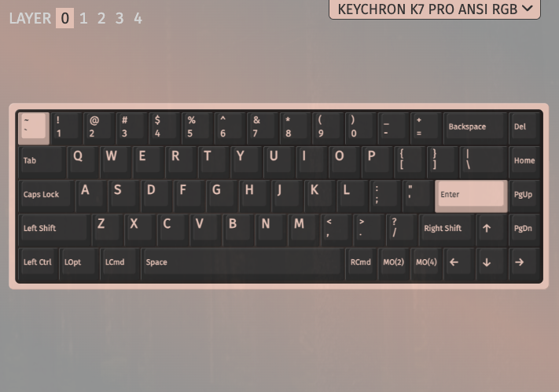
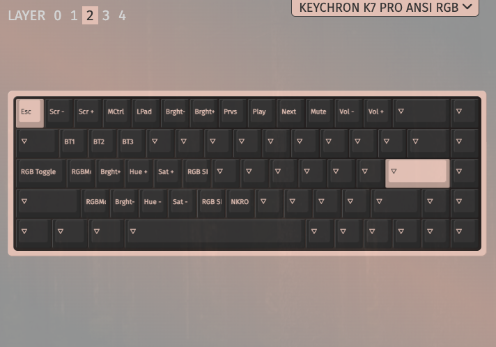

# KeyChron Keyboard Layouts

## `k7-layou.layout.json`

The only change here as of 24.08.03 is the Esc/` keys. I've remapped the esc key to return `/~ as the default, and `Esc` when holding the M0(2) key (F1).

### Layer 1

### Layer 2 (holding `F1`)

